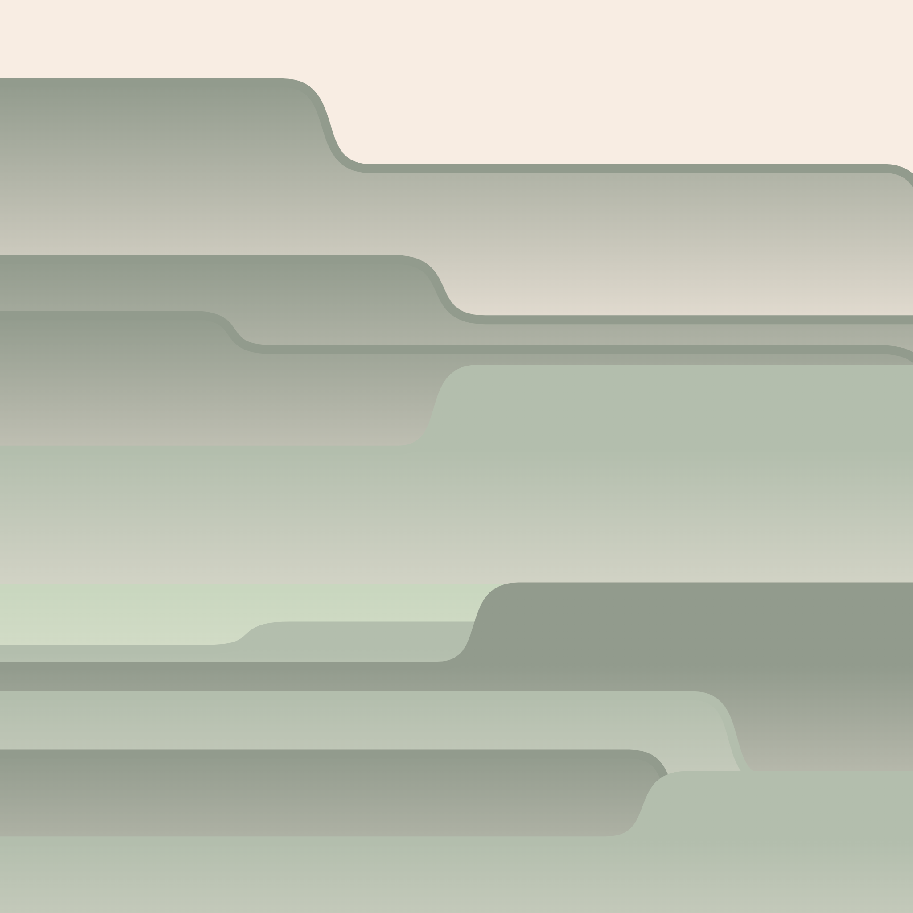
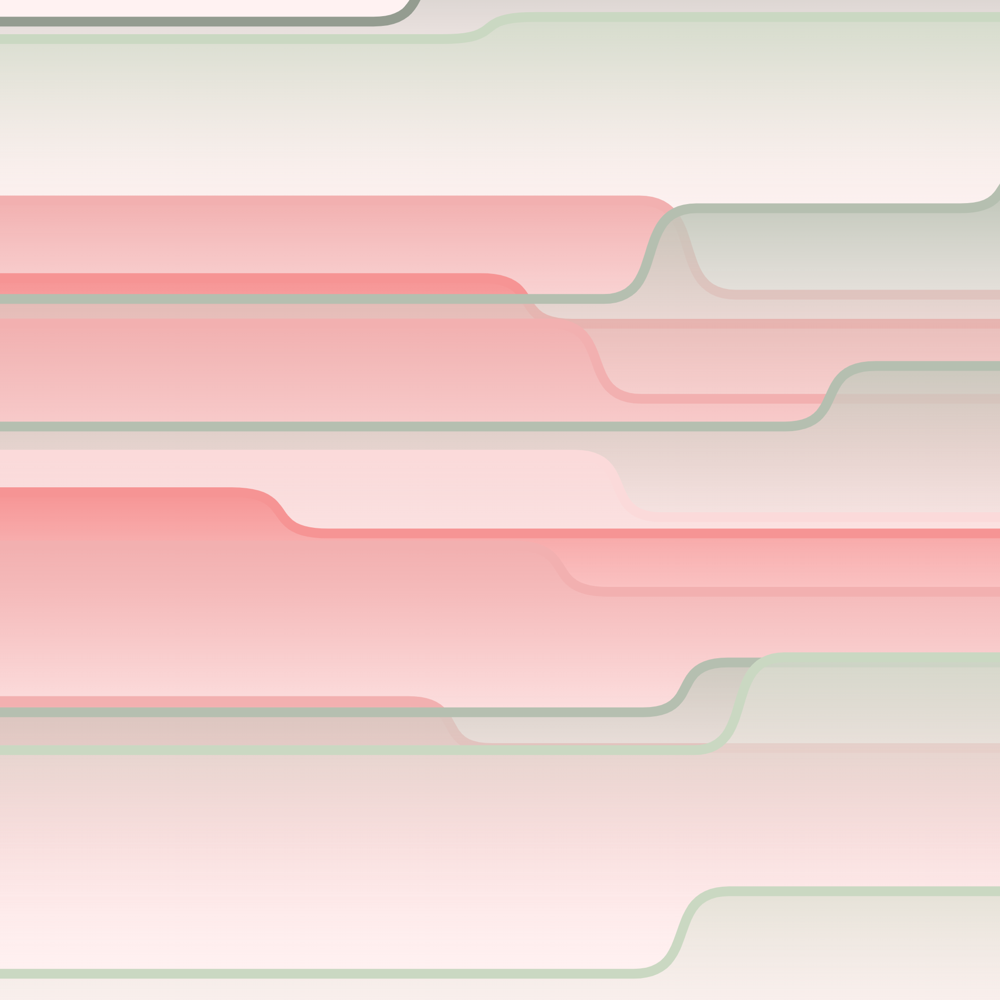
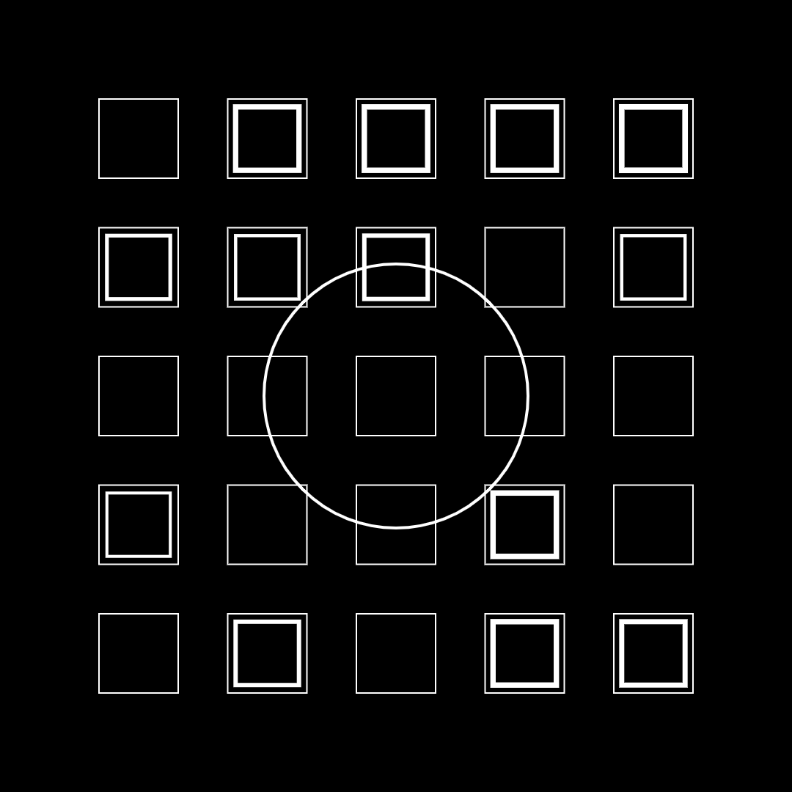
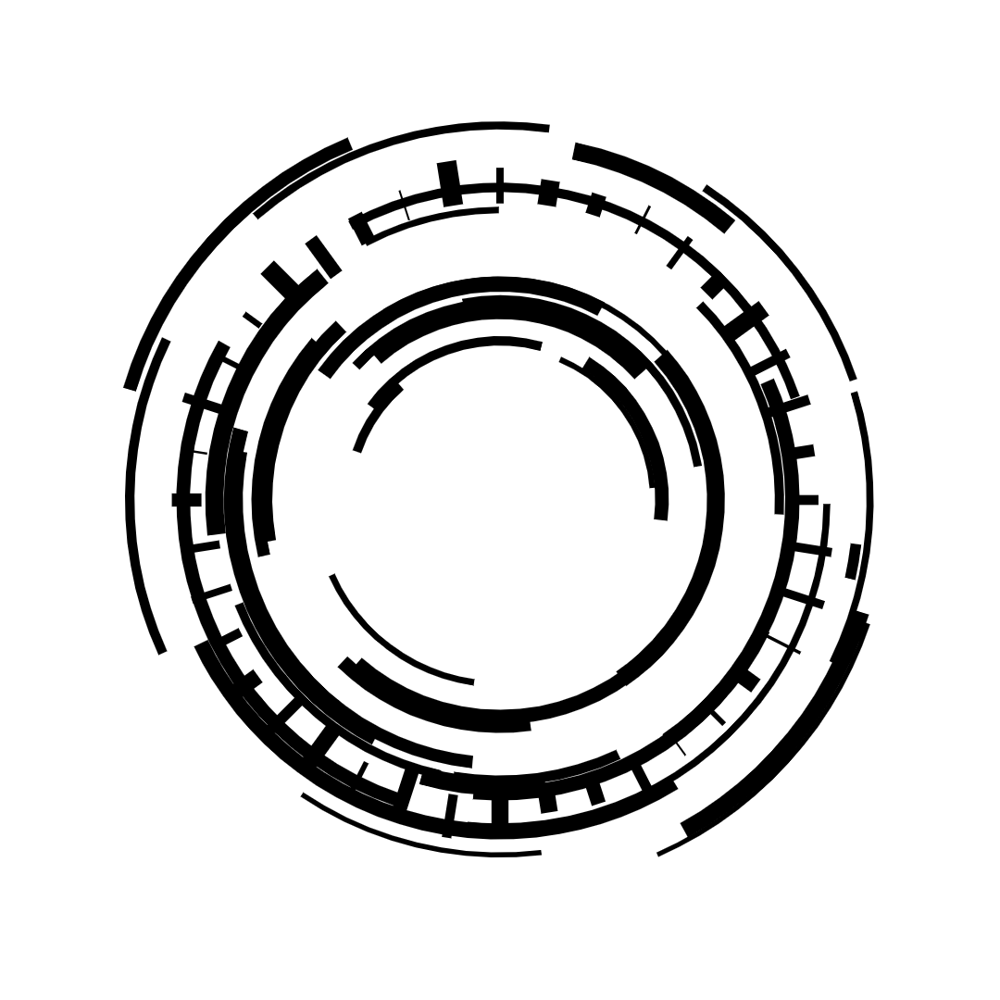
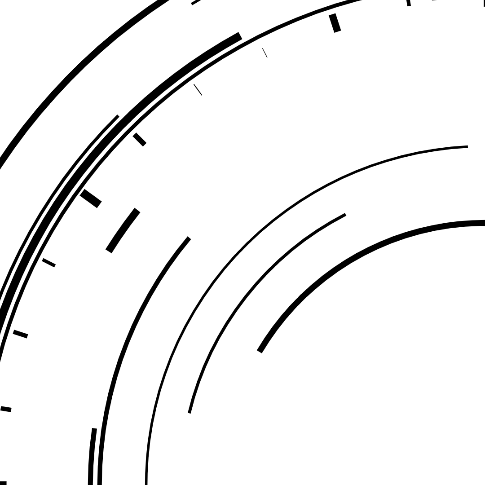
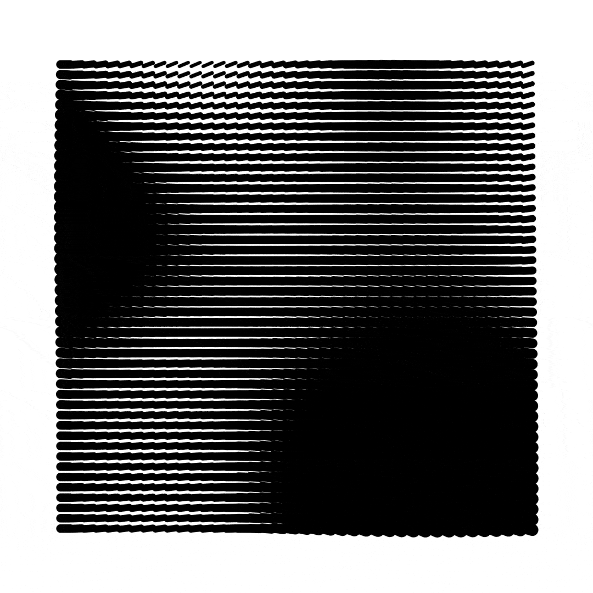
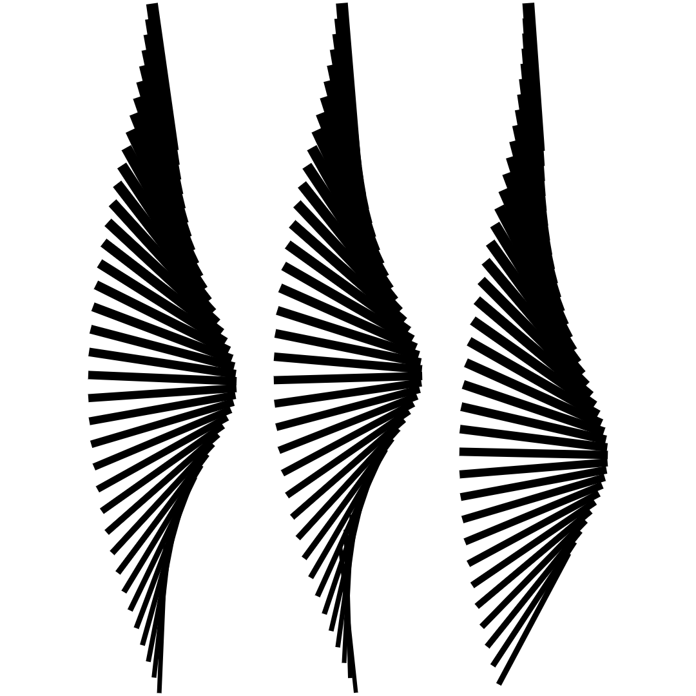
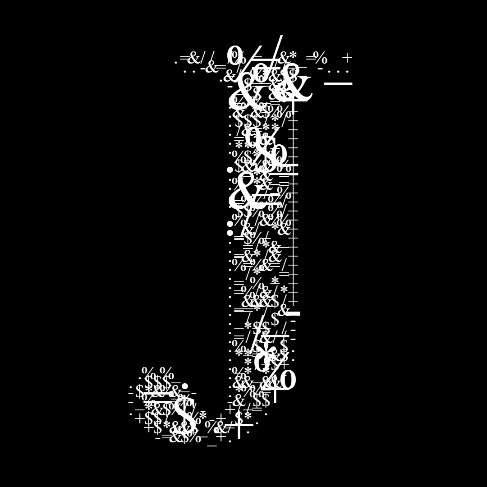
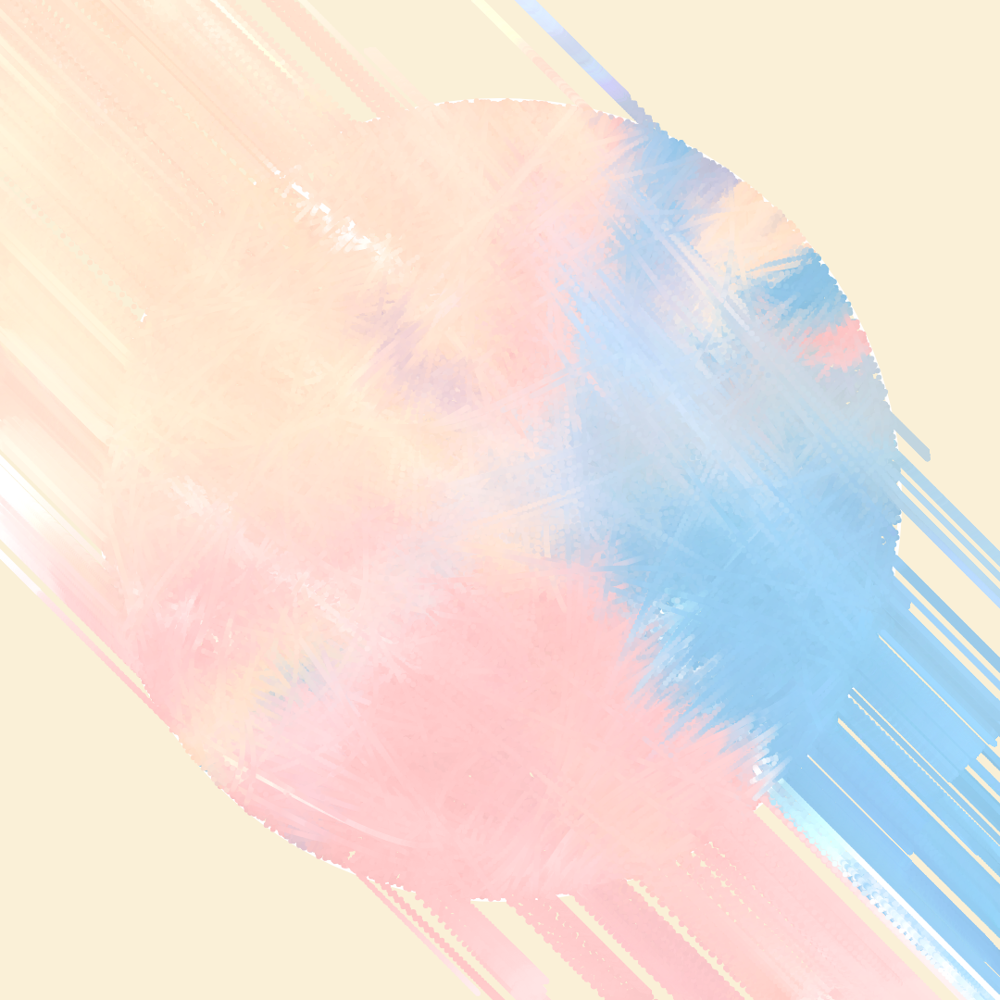
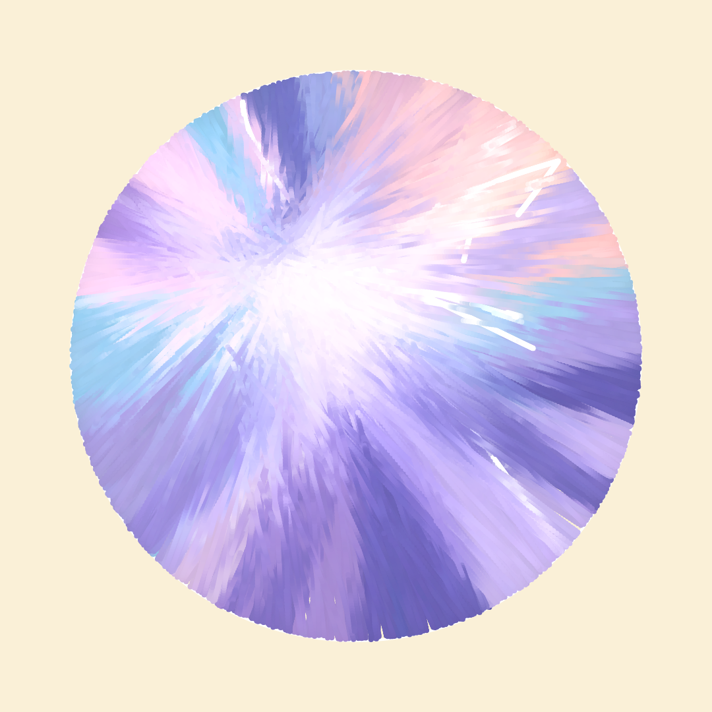

# ad81ef





# Course "Creative Coding: Programmiere visuelles Material mit JavaScript" on Domestika

## Sketch 1
Basic html canvas operations


Install `canvas-sketch-cli`
```shell
npm i canvas-sketch-cli -g
```
Generated with `canvas-sketch`:
```
cd sketches
canvas-sketch sketch-01.js
```


## Sketch 2
```
cd sketches
canvas-sketch sketch-02.js
```


Task to only show a quater


## Sketch 3
```
cd sketches
canvas-sketch sketch-03.js
```


## Sketch 4
```
cd sketches
canvas-sketch sketch-04.js
```



## Sketch 5
```
cd sketches
canvas-sketch sketch-05.js
```


## Final Sketch
```
cd sketches
canvas-sketch final-sketch.js
```

